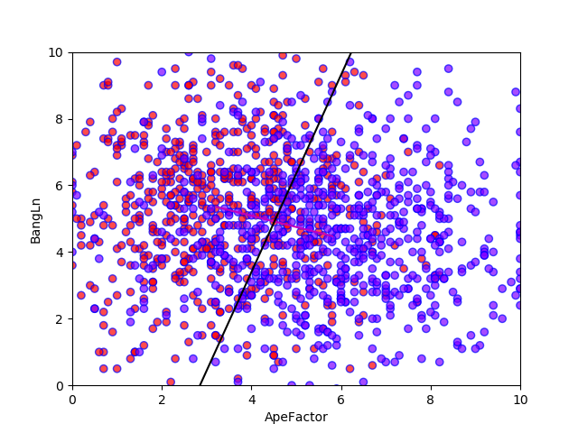
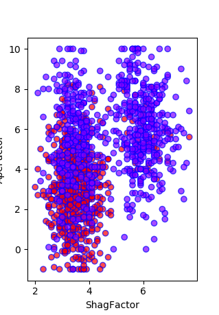
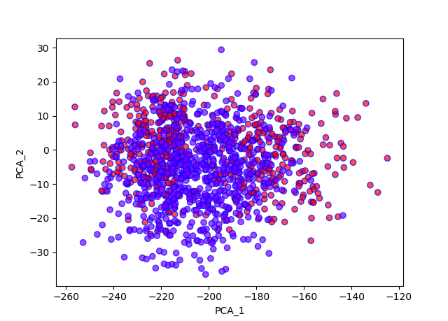

---
puppeteer:
  landscape: false
  format: "A4"
  timeout: 3000 # <= Special config, which means waitFor 3000 ms
  printBackground: true
---

 #  <center> CSCI 720 Big Data Analytics HW09 Results </center> 
---
Student: Guo, Zizhun & Qian, Martin
Submission: Apr/18st/2020
Due Date: Apr/18st/2020 11:59 PM 

---

#### 3. Feature Selection using Cross-Correlation

###### CC in three significant digits:
```py
def CC_analysis(data):
    '''
    Using correlation coefficient to analyze data
    '''
    CC_mat = data.loc[:, data.columns != 'Class'].corrwith(data['Class'])
    CC_mat = CC_mat.apply(lambda x: round(x, 3))
    return CC_mat
```

```py
# CC results
Age             -0.283
Ht              -0.010
TailLn          -0.266
HairLn          -0.095
BangLn           0.203
Reach           -0.092
EarLobes         0.043
TailLessHair    -0.222
TailLessBang    -0.340
ShagFactor      -0.515
TailAndHair     -0.259
TailAndBangs    -0.159
HairAndBangs     0.049
AllLengths      -0.157
ApeFactor       -0.537
HeightLessAge    0.193
dtype: float64
```
Feature1: **ApeFactor**; CC = **-0.537**
Feature2: **BangLn**; CC = **0.203**

###### Projection Vector:
So the projection vector should be the vector from the center of the attribute ApeFactor to the center of the BangLn
```py
    plt.plot([CA[0],CB[0]],[CA[1],CB[1]],\
        'm-' , label = 'projection vector')
    x = range(2 , 8)
```
###### Decision Boundary:
Dicision boundry is the vertical line of thr projection vector.
```py
    plt.plot(x, -(CA[0]-CB[0])/(CA[1]-CB[1]+0.)*(x-(CA[0]+CB[0])/2.)+(CA[1]+CB[1])/2. ,\
         'k-', label='decision boundry')
```



<center> Image1: Feature Selection Scatter Plot </center>

**Results (Accuracy for this classifier):** **0.753**

#### 4. Brute Force Search for 2 Best Features
```py
def BFS_analysis(data):
    '''
    Using Brute Force Search to analyze data
    '''
    score = 0
    score_second = 0
    for feature1 in data.columns:
        for feature2 in data.columns:
            if feature1 != feature2 and feature1 != 'Class' and feature2 != 'Class':
                # LDA classifier
                clf = LinearDiscriminantAnalysis(solver = 'eigen', n_components = 1)
                clf.fit(data.loc[: ,[feature1, feature2]], data['Class'])
                curr_score = clf.score(data.loc[: ,[feature1, feature2]], data['Class'])
                if( curr_score > score):
                    score_second = score
                    score = curr_score
                    features = [feature1 , feature2]
                    best_clf = clf
    return features, score, best_clf
```
So the highest score is achieved with the following features
Feature1: **ShagFactor**
Feature2: **ApeFactor**


<center> Image2: Bruce For Search Best Classifier Scatter Plot </center>

**Results (Accuracy):** **0.817**

##### Question: What is the best classification accuracy this produces? What is the second best classification accuracy this produces?

**Best: 0.817**
**Second Best: 0.778**

#### 5. Principal Components Analysis

##### PCA algorithm in sklearn

```py
    pca = PCA(n_components = 7)
    pca.fit(data.loc[:, data.columns != 'Class'])
    print("eigen vectors of PCA\n"+str(pca.components_))
    print("singular values of PCA\n"+str(pca.singular_values_))
```
###### Eigenvectors of PCA(let's take first 7 as example):
```py
[[-0.023 -0.58  -0.046 -0.006 -0.004 -0.582 -0.003 -0.041 -0.042 -0.001
  -0.052 -0.051 -0.01  -0.056 -0.002 -0.557]
 [ 0.723  0.19   0.128  0.019 -0.005  0.227  0.003  0.109  0.133  0.023
   0.147  0.123  0.014  0.142  0.037 -0.533]
 [-0.249 -0.146  0.335  0.093  0.077 -0.133  0.002  0.241  0.258  0.017
   0.428  0.411  0.17   0.505  0.012  0.103]
 [ 0.066  0.041 -0.21   0.269  0.25   0.012 -0.02  -0.479 -0.46   0.019
   0.06   0.041  0.52   0.31  -0.03  -0.025]
 [-0.183 -0.309 -0.02   0.102 -0.093  0.441 -0.011 -0.123  0.073  0.196
   0.082 -0.114  0.009 -0.012  0.75  -0.125]
 [ 0.037  0.095 -0.001  0.288 -0.312 -0.15   0.006 -0.289  0.311  0.6
   0.287 -0.314 -0.024 -0.026 -0.245  0.058]
 [-0.003 -0.005 -0.006  0.005  0.006  0.003  0.    -0.01  -0.011 -0.001
  -0.001  0.     0.01   0.005  0.009 -0.003]]
```
###### singular values of PCA
```py
[931.941 573.253 457.488 260.495 109.357  62.967  10.034]
```
##### What do the coefficients in the eigenvector tell you about which features are important?

First of all, by definition of Principal Components, the eigen vector with greater singular values works as a better vector to project and have a better effect on seprating the data.
Secondly, the eigen vector stands for the coefficient multipled with the features of raw data, so apparently, the more its absolute value is, the more importance the corresponding feature has. 
However, we know that PCA is used to do demission reduction. At the same time, we only have 6 features at first and the rest are linear combinations of these 6 features. As a results, these new feature should have no impact on the final eigenvectors.(Because the rank of the data is 6, it would break mathematic rules if it has more than 6 eigen vectors. So the result also supprted my opinion as eigen vectors that are more than 6 are nearly all 0s)

 
#### 6. Projection onto PCA
Since the first two singular values are the greatest among all, project the data onto the first two Principal Components.


<center> Image3: PCA Scatter Plot using first two eigen vectors</center>

On the other hand, I also get the projection scatter plot with only original dataset as following. And these two graphs are quite similar(if we ratote one of them by 180 degrees we can see distribution similarity).


<center> Image4: PCA Scatter Plot using original dataset</center>


#### 7. Gradient Descent
```py
theta, rho =  Gradient_Descent__Fit_Through_a_Line_v100(\
        [data[features[0]],data[features[1]],data['Class']] , 62.7, 11.2 ,4.5)
```
By calling the method from HW8 and modify their parameters( 62.7 is initial theta, 11.2 is initial rho and 4.5 is initial alpha, they are calculated mannually with two centers of selected features), we could using gradient descent for this question. We set the loss function as misclassification rate. By the way, the initial features I selected are ApeFactor and ShagFactor, I think they are more reasonable because first their correlaton coefficient absolute are biggest, although both are negative, and second they are selected as features from part of brute force.


<center> Image5: Boundry given by GD</center>

###### Result of gradient descent
```
starting point:0.458 * x + 0.889 * y = 11.2(theta = 62.7)
final result: 0.781 * x + 0.6241 * y + -6.09 = 0   
Accuracy is 0.817
```
This is an interesting result, and the accuracy it gives is very closed to the one given by Linear Discriminant Analysis. So I think this is the limitation linear classifier can achieve on this dataset.

#### 8. Conclusions
With all works above, the final classifier we choose is the decision boudary caculated by gradient descent algorithm decribed above, and generated prediction dataset.